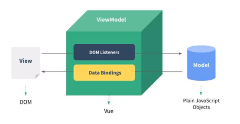

# 邂逅Vuejs

## 认识Vuejs

Vue是一个渐进式框架，什么是渐进式？

- 渐进式意味着你可以将Vue作为你应用的一部分嵌入其中，带来更丰富的交互体验。
- 或者如果你希望将更多的业务逻辑使用Vue实现，那么Vue的核心库以及其生态系统。
- 比如Core+Vue-router+Vuex，也可以满足你各种各样的需求。

Vue有很多特点和Web开发中常见的高级功能

- 解耦视图和数据
- 可复用的组件
- 前端路由技术
- 状态管理
- 虚拟DOM

安装Vue的方式

- 方法一：直接CDN引入
- 
  ```html
    <!-- 开发环境版本，包含了有帮助的命令行警告 -->
    <script src="https://cdn.jsdelivr.net/npm/vue/dist/vue.js"></script>
    <!-- 生产环境，优化了尺寸和速度 -->
    <script src="https://cdn.jsdelivr.net/npm/vue"></script>
  ```
- 方法二：下载和引入
- 
  开发环境: https://vuejs.org/js/vue.js

  生产环境: https://vuejs.org/js/vue.min.js

- 方法三：NPM安装
  后续通过CLI和webpack的使用，使用该方法。

[一个计数器案例](../demos/demo3/index.html)

Vue中的MVVM



## v-once的使用

该指令后面不需要跟任何表达式。

该指令表示元素和组件只渲染一次，不会随着数据的改变而改变。

[代码示例](../demos/demo4/index.html)
```html
<div id="app">
<h1>{{message}}</h1>                <!-- 123 -->
<h1 v-once>{{message}}</h1>         <!-- hello world -->
</div>

<script>
  const app = new Vue({
    el: '#app',
    data: {
      message: 'hello world'
    }
  })

  app.message = '123';
</script>
```